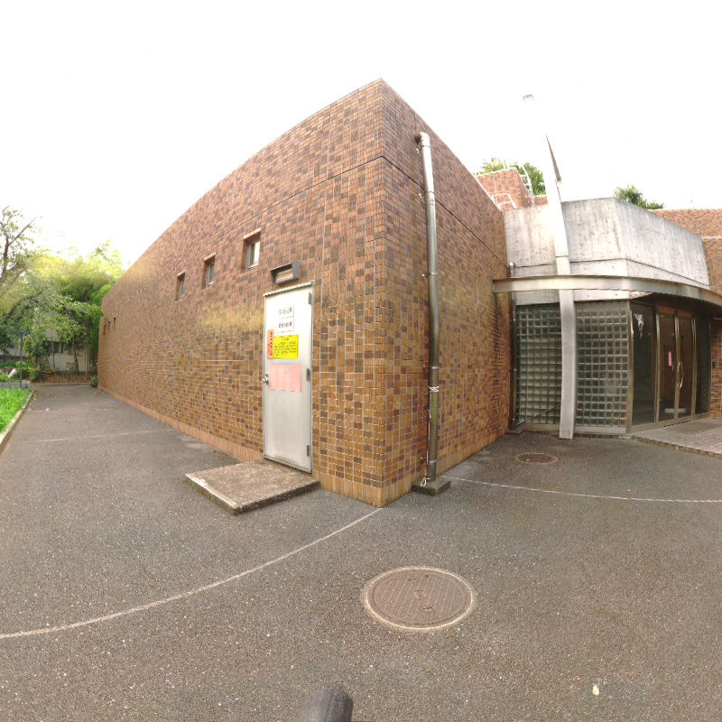
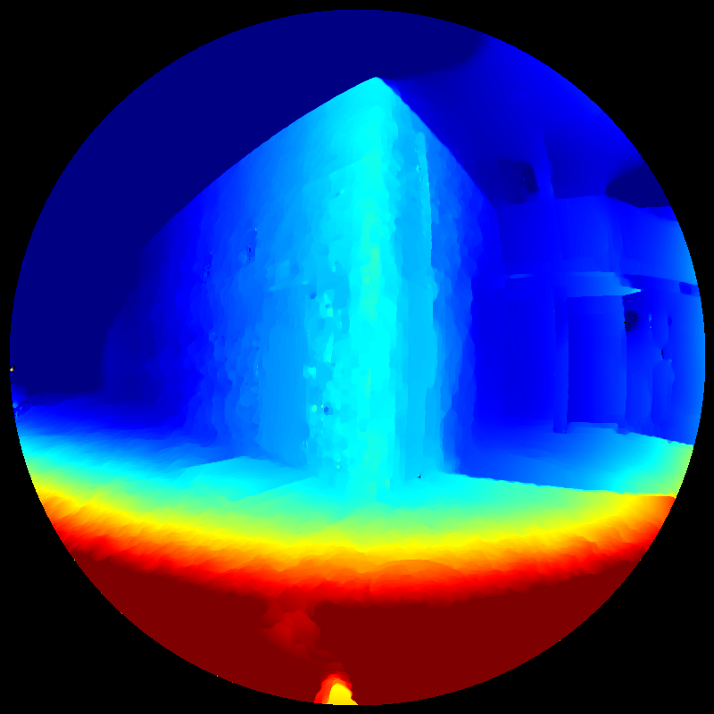
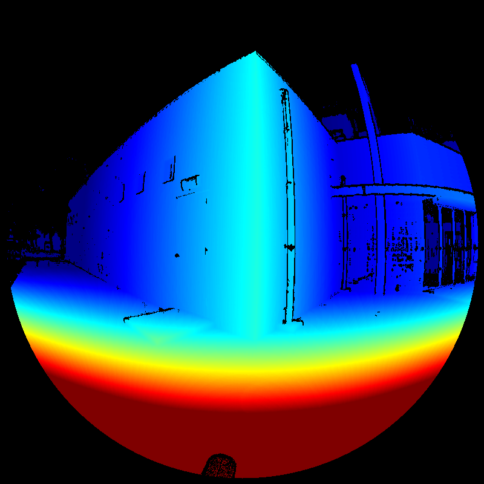

# Variational Fisheye Stereo (VFS-Python)
***VFS-Python*** is a python implementation for variational fisheye stereo [1].

## Depth estimation result
(left to right) first frame image, estimated depth image, ground-truth depth image





## Differences from official implementation
For convenience of parameter tuning, trial and error, the author implemented the method using CUDA and CuPy.
Using of NVRTC runtime compiler has some advantages over AOT compilation, e.g., CMake is not required, easy debugging, visualization and so forth.
The implementation has the following differences from official implementation.
* omit deprecated texture binding and migrate to bindless texture
* fix some of bugs
  + [translation scale of vector field generator](https://github.com/menandro/vfs/issues/13)
  + grid size of threads in diffusion tensor computation
* reduce code amount by using template function
* add ICRA 2020 dataset loader
* add equidistant camera model triangulation and vector field generator

Although it has similar logic the implementation detail is quite different so the author licenses it under the BSD-2.

## Requirements
***VFS-Python*** requires the following libraries:
+ cupy
+ opencv
+ nose (only for testing)
+ open3d (only for visualization)

## Usage
```sh
python main_equidistant.py
```

## References
1. Roxas, M., & Oishi, T. (2020). Variational fisheye stereo. IEEE Robotics and Automation Letters, 5(2), 1303-1310.
